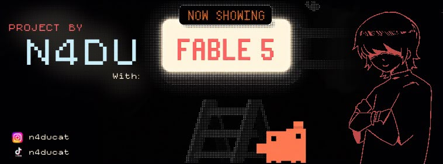

<p align="center">
  
</p>

<h1 align="center">🎵 Songs & Words</h1>

<p align="center">
  <strong>Learn English vocabulary through the songs you love.</strong><br>
  A keyboard-first practice app: capture the words you didn't know from each song
  and drill them with dynamic, cover-tinted backgrounds.
</p>

<p align="center">
  
  
  
  
</p>

---

## Why

Songs are full of words you *almost* know. **Songs & Words** turns that into a study system:
every time a song teaches you something new, you save the word under that song — and later
you practice them song by song, with the whole screen taking on the mood of that song's cover art.

No accounts, no cloud, no tracking. Everything lives in a local SQLite database on your machine.

## Screenshots

|  |  |
| --- | --- |
|  |  |
| **Home** — your library, with a living aurora background tinted by your own covers. It reshuffles on every visit. | **Practice** — the song's cover becomes the atmosphere: blurred, darkened, breathing slowly behind the card. |
|  |  |
| **Editor** — title, cover image and the word pairs you collected from the song. | **Summary** — first-try accuracy at the end of each session. |

## Getting started

```bash
git clone https://github.com/N4DU/Songs_Words.git
cd Songs_Words
pip install -r requirements.txt
python main.py
```

That's it — your browser opens automatically. Press `Ctrl+C` in the terminal (or just close the tab) to stop.

## Keyboard controls

| Key | Action |
| --- | --- |
| `↑` `↓` | Move through songs / options |
| `← ` `→` | Move between buttons · open a song's action menu |
| `Space` | Select / deselect a song for practice |
| `Enter` | Confirm · check your answer |
| `Backspace` | On an empty word row in the editor: remove it |
| `Esc` | Go back · end practice · exit |

## How it works

```
main.py              → entry point: free port, browser launch, console banner
app/                 → Flask backend
  ├── config.py      → paths and constants
  ├── database.py    → SQLite schema + queries (songs, words, settings)
  ├── api.py         → REST API (CRUD, practice, settings)
  ├── server.py      → app factory
  └── lifecycle.py   → clean shutdown when the tab closes (sendBeacon)
static/              → frontend, no frameworks
  ├── index.html
  ├── css/styles.css → dark glassmorphism + aurora
  └── js/            → ES modules: views, color engine, keyboard router
```

The color engine (`static/js/color.js`) downsamples each cover on a canvas, extracts its
dominant hues for the theme, and reuses a tiny blurred copy of the image itself as the
practice backdrop — so the atmosphere comes from the whole artwork, not a single color.

## License

Copyright © 2026 **N4DU**

This project is licensed under the **GNU Affero General Public License v3.0** — see [LICENSE](LICENSE) for details.
